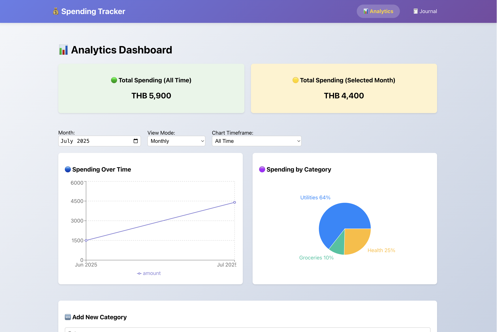
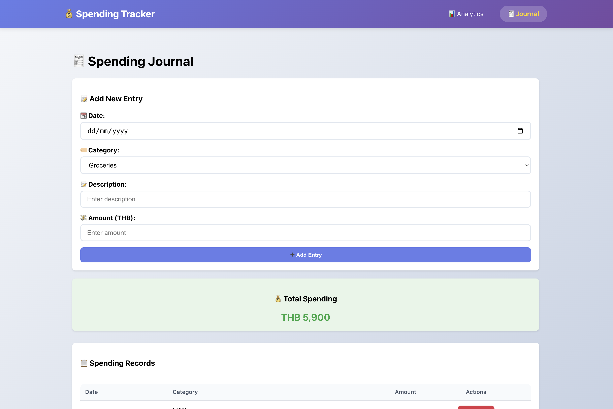
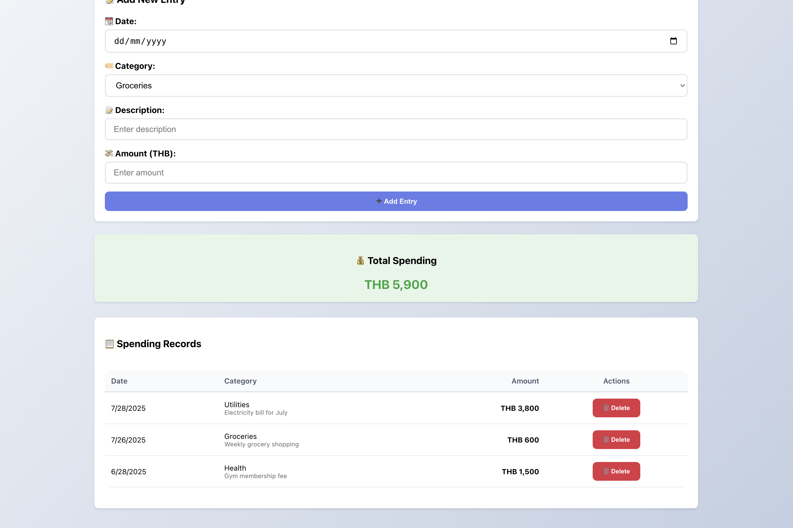
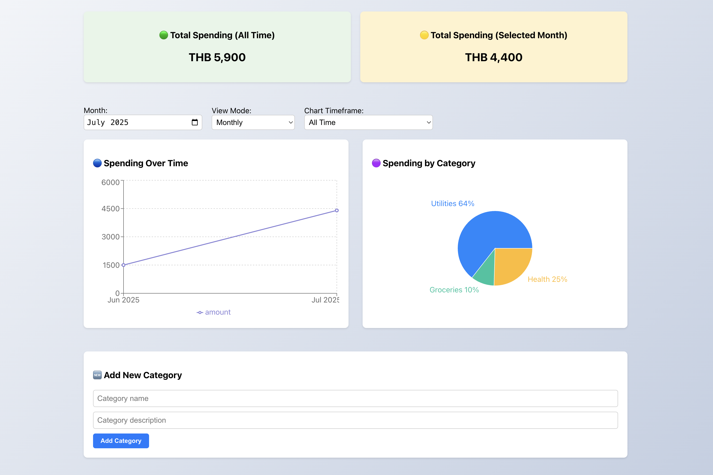

# 💰 Finance Tracker

A responsive web app for tracking personal expenses with visual analytics and a simple journaling interface.

## 🙌 Contribution  
**Puran Paodensakul**  
**Gulizara Benjapalaporn**

---

## 📸 Screenshots

| Analytics Dashboard | Journal View 1 | Journal View 2 | Add Category |
|---------------------|----------------|----------------|--------------|
|  |  |  |  |

---

## 🚀 Features

- 📊 **Analytics Dashboard**  
  Line & pie charts with daily, weekly, and monthly spending views.

- 📘 **Journal**  
  Log expenses by date, category, and amount (THB).

- 🏷️ **Custom Categories**  
  Add your own categories with descriptions and icons.

- 💾 **Local Storage**  
  All data is stored persistently in the browser.

- 📱 **Responsive Design**  
  Optimized for both desktop and mobile use.

---

## 🛠 Tech Stack

- React 18 + TypeScript  
- React Router  
- Recharts  
- React-use (localStorage)  
- Vite (build tool)

---

## 📦 Setup

```bash
git clone <your-repo-url>
cd v-shop
npm install
npm run dev

# 👥 Team Members
### Puran Paodensakul
### Gulizara Benjapalaporn
